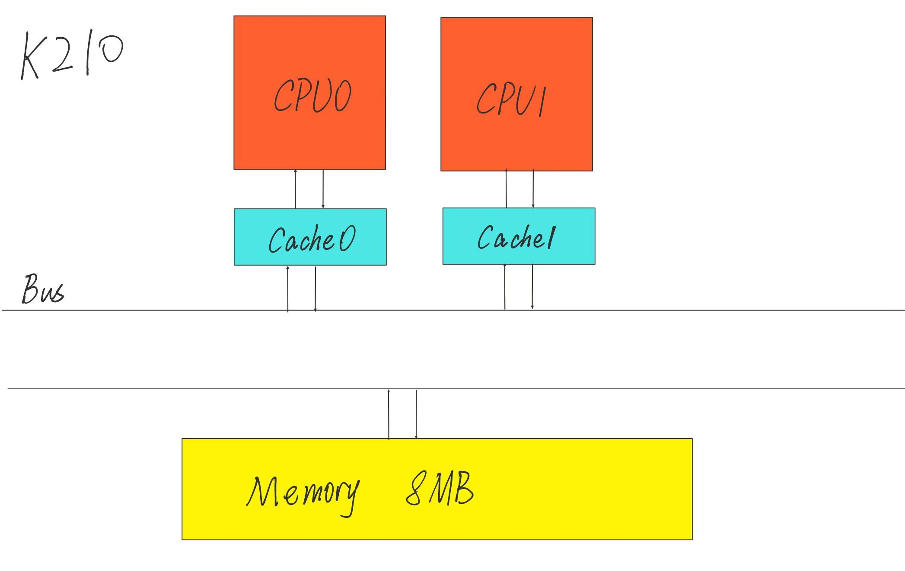

# 多核设计

[toc]

本项目在rCore-Tutorial-v3的基础上完成多核设计.多核架构是**SMP**架构,即对称多核架构,这部分设计的工作量主要在于多核启动和多核调度.




​																			(图1) K210架构


## 多核启动

CPU上电后会先在M态执行SBI程序进行硬件相关的初始化.

在单核的情况下,CPU会直接跳转到SBI设置的FW_JUMP地址继续执行.

但在多核的情况下,全部CPU执行完初始化后仅有一个CPU会直接跳转到FW_JUMP地址继续执行.其他的核需要被已经跳转到下一步执行的CPU进行SBI的环境调用去唤醒.

在具体实现中,由于RunOS的qemu平台使用的SBI是OpenSBI,而k210版本的SBI使用的是RustSBI,所以主函数os_main有两套实现.两个SBI在启动多核的逻辑有所不同,具体的区别是OpenSBI是随机选择一个核继续执行,所以首次执行_start的CPU不一定是0号CPU.而RustSBI则是固定使用0号CPU.另一个区别唤醒其他核的环境调用API不同,但区别不大.方便起见,以下以qemu OpenSBI为例分析源码.


```assembly
# kernel/src/entry.asm

    .section .text.entry
    .globl _start
_start:
    mv tp, a0
    add t0, a0, 1
    slli t0, t0, 16
    la sp, boot_stack
    add sp, sp, t0
    call os_main

    .section .bss.stack
    .globl boot_stack
    .globl boot_stack_top
boot_stack:
    .globl boot_stack
    # 64K 启动栈大小 * CPU_NUMS
    .space 4096 * 16 * 4
boot_stack_top:
    .globl boot_stack_top
```


_start函数是CPU核从SBI初始化完跳转执行的第一个函数,主要工作就是分配启动栈和确认自己的CPU_ID.

SBI在跳转之前会将CPU_ID放到a0寄存器中,在_start开头直接将CPU_ID储存在tp寄存器,tp是RISC-V架构的thread_pointer,也就是线程指针,标志线程的ID,由于本OS没有实现多线程,所以就让tp储存Hart也就是硬件线程的ID,即CPU_ID.并且这个寄存器的值在以后的Supervisor态都不会更改.往后要确定自己的CPU_ID则会直接调用以下内联函数**hart_id**.

```Rust
#[inline]
pub fn hart_id() -> usize {
    let id;
    unsafe { asm!("mv {0}, tp", out(reg) id) };
    id
}
```

hart_id是至关重要的,也是多核OS实现的基础,往后调度程序都依赖这个确认自己CPU身份的函数.


_start接下来根据CPU_ID分配CPU的启动栈,也是S态执行的内核栈.启动栈boot_stack划在.bss.stack段,也在entry.asm中.每个CPU分配64KB的栈空间.现阶段是够用的.没有溢出的问题.在调试中如果出现溢出了很可能是程序逻辑的问题,比如掉入**"调用黑洞"**,函数栈帧无限增加导致栈溢出.


_start执行完后会跳到os_main继续执行初始化.之后的程序基本上就是用Rust语言实现的.


```Rust
// kernel/src/main.rs

// qemu opensbi
#[cfg(all(feature = "qemu", feature = "opensbi"))]
#[no_mangle]
fn os_main(hartid: usize, dtb_ptr: *mut u8) {
    if !SMP_START.load(Ordering::Acquire) {
        clear_bss();
        // println!("here 0");
        trap::init();
        dt::init(dtb_ptr);
        mm::boot_init();
        logo::show();
        scheduler::add_initproc();
        logger::init();
        logger::show_basic_info();
        // fs::list_apps();
        timer::init();
        // SMP_START will turn to true in this function
        cpu::boot_all_harts(hartid);
        scheduler::schedule();
    } else {
        trap::init();
        mm::init();
        timer::init();
        log::info!(
            "{}",
            alloc::format!("Hart {} successfully booted", hart_id()).green()
        );
        scheduler::schedule();
    }
}
```


os_main最开始有个SMP_START条件判断os_main是否被第一次执行.如果是的话需要大量初始化工作,包括清bss,设置自己CPU的异常中断处理函数地址**trap::init**,读设备树,虚拟内存管理初始化,调度初始化,时钟中断初始化等.这些具体内容和rCore-Tutorial-v3基本一致,所以不赘述.在进行完这些初始化之后,并在真正调度开始之前调用**boot_all_harts**唤醒其他核,这个函数内容如下.


```Rust
// kernel/src/cpu/mod.rs

#[cfg(all(feature = "opensbi", feature = "qemu"))]
pub fn boot_all_harts(my_hartid: usize) {
    extern "C" {
        fn _start();
    }
    BOOT_HARTID.store(my_hartid, Ordering::Relaxed);
    SMP_START.store(true, Ordering::Relaxed);
    let ncpu = CPU_NUMS.load(Ordering::Acquire);
    for id in (0..ncpu).filter(|i| *i != my_hartid) {
        // priv: 1 for supervisor; 0 for user;
        hart_start(id, _start as usize, 1).unwrap();
    }
}
```


**boot_all_harts**很简单,主要就是把作为做了大量初始化工作的CPU_ID记录下作为启动核,启动核没什么特殊的,因为这是一个SMP架构的多核OS,记录下来只是作为纪念.然后设置SMP_START为真,表示启动工作做完了.随后对剩下的每个CPU调用**hart_start**,唤醒它们然后让它们跳转到**_start**继续开始启动核经历过的旅程.

非启动核也会执行最上面的汇编程序**_start**获得自己的内核栈和tp指针上的"身份标识".随后也是进入**os_main**继续完成初始化工作.

非启动核执行的初始化分支与启动核不同,只需要设置自己CPU的异常中断处理函数地址**trap::init**,使能虚拟内存,设置时间中断.

```Rust
// kernel/src/main.rs

	} else {
        trap::init();
        mm::init();
        timer::init();
        log::info!(
            "{}",
            alloc::format!("Hart {} successfully booted", hart_id()).green()
        );
        scheduler::schedule();
    }
```


需要说明的是,很多启动核做过的工作不需要再重复执行,如果做了甚至会造成严重后果,比如重复**clear_bss**可能会抹去重要数据,内存的物理页帧重复初始化可能会导致OS崩溃.


多核初始化完之后就进入**scheduler::schedule()**函数执行调度程序.多核调度在接下来的文字中分析.


## 多核调度


与rCore-Tutorial-v3把调度部分作为任务task设计的一部分不同的是,RunOS把调度独立出来做成了单独的模块,并且给调度模块设计了泛型,給RunOS替换不同调度算法提供了便利.这部分实现都在项目的*<u>kernel/src/scheduler</u>*之中,其中最重要的就是提供调度器特性(接口)**Scheduler**,代码如下.


```Rust
// kernel/src/scheduler/mod.rs

pub trait Scheduler {
    fn schedule(&self);
    fn add_task(&self, task: Arc<TaskControlBlock>);
    fn fetch_task(&self) -> Option<Arc<TaskControlBlock>>;
}
```


**Scheduler**特性将调度器最核心的方法都抽象了出来,包括任务加入就绪队列,任务从就绪队列取出,让任务调度给CPU运行.具体的调度实现可以以此为基础实现各种调度算法,比如Round_Robin轮询算法或者优先级调度算法.这是RunOS另一大改进.RunOS实际实现的调度是Round_Robin算法,具体如下.


```Rust
// kernel/src/scheduler/round_robin.rs

struct Queue {
    queue: VecDeque<Arc<TaskControlBlock>>,
}

pub struct RoundRobinScheduler {
    ready_queues: Vec<Mutex<Queue>>,
}
```


结构体RoundRobinScheduler中设置了就绪队列向量ready_queues,向量中可以增减任务队列queue的数量,具体芯片有几个CPU就可以加入几个任务队列.结构体Queue是任务控制块的引用的双端队列.注意到任务队列有互斥锁Mutex保护,多核的同步互斥在接下来会讲,现在先略过.RoundRobinScheduler对Scheduler特性的实现如下.


```Rust
// kernel/src/scheduler/round_robin.rs

impl Scheduler for RoundRobinScheduler {
    fn schedule(&self) {
        loop {
            interrupt_off();
            if let Some(task) = self.fetch_task() {
                // if hart_id() == 1 {
                //     log::debug!("have task");
                // }
                let mut cpu = take_my_cpu();
                let idle_task_cx_ptr = cpu.get_idle_task_cx_ptr();
                // access coming task TCB exclusively
                let mut task_inner = task.acquire_inner_lock();
                let next_task_cx_ptr = &task_inner.task_cx as *const TaskContext;
                task_inner.task_status = TaskStatus::Running;
                // release coming task PCB manually
                drop(task_inner);
                // add task cx to current cpu
                cpu.current = Some(task);
                // cpu task count + 1
                cpu.task_cnt += 1;
                // release cpu manually
                drop(cpu);
                // schedule new task
                unsafe { __schedule(idle_task_cx_ptr, next_task_cx_ptr) }
            } else {
                idle_task();
                // log::debug!("Hart {} have no task", hart_id());
            }
        }
    }
    fn add_task(&self, task: Arc<TaskControlBlock>) {
        let (i, selected) = self
            .ready_queues
            .iter()
            .enumerate()
            .min_by_key(|queue| queue.1.lock().queue.len())
            .unwrap_or((0, &self.ready_queues[0]));
        // if i == 1 {
        //     log::debug!("Hart {} add task {} to queue {}", hart_id(), task.pid.0, i);
        // }
        selected.lock().queue.push_back(task);
    }
    fn fetch_task(&self) -> Option<Arc<TaskControlBlock>> {
        self.ready_queues[hart_id()].lock().queue.pop_front()
    }
}
```


**add_task**和**fetch_task**都很简单,**schedule**需要具体说说.

**schedule**函数是一个大循环,这一点和rCore-Tutorial-v3一样,不同的是RunOS需要关闭中断防止时钟中断再次触发调度.同时在无事可做时进入**idle_task**执行统计任务.进入**idle_task**之后打开时钟中断等待下一次调度.可能有隐藏bug会导致**idle_task**错过时钟中断,目前暂时还没对此处理.

值得一提的是每个CPU都会执行这个**schedule**函数进行调度,因为RunOS是**SMP**架构.


调度方面更详细的内容会在另一份文档,即调度逻辑中提供.那份文档会结合具体任务生命期讲解.


## 多核互斥同步

多核的同步互斥通过互斥锁实现,很多数据区只允许互斥访问.这是多核配合的基础,非常重要.幸运的是Rust有现成的互斥模块可以使用,模块名如下.


```rust
// kernel/Cargo.toml

spin = "0.9.2"
```


RunOS在很多地方都使用了互斥锁进行全局保护,比如内核地址空间就使用了Mutex保护

```Rust
// kernel/src/mm/address_space.rs	

lazy_static! {
    pub static ref KERNEL_SPACE: Mutex<AddrSpace> = Mutex::new(AddrSpace::create_kernel_space());
}
```


物理页帧分配器也使用了Mutex保护

```Rust
// kernel/src/mm/frame.rs

lazy_static! {
    pub static ref FRAME_ALLOCATOR: Mutex<FrameAllocatorImpl> =
        Mutex::new(FrameAllocatorImpl::new());
}
```


任务的内核栈分配器和PID分配器也使用了Mutex保护

```Rust
// kernel/src/task/kernel_stack.rs

lazy_static! {
    static ref KSTACK_ALLOCATOR: Mutex<RecycleAllocator> = Mutex::new(RecycleAllocator::new());
}
```


```Rust
// kernel/src/task/pid.rs

lazy_static! {
    static ref PID_ALLOCATOR: Mutex<RecycleAllocator> = Mutex::new(RecycleAllocator::new());
}
```


Mutex使用时则调用lock方法即可,不再赘述.
